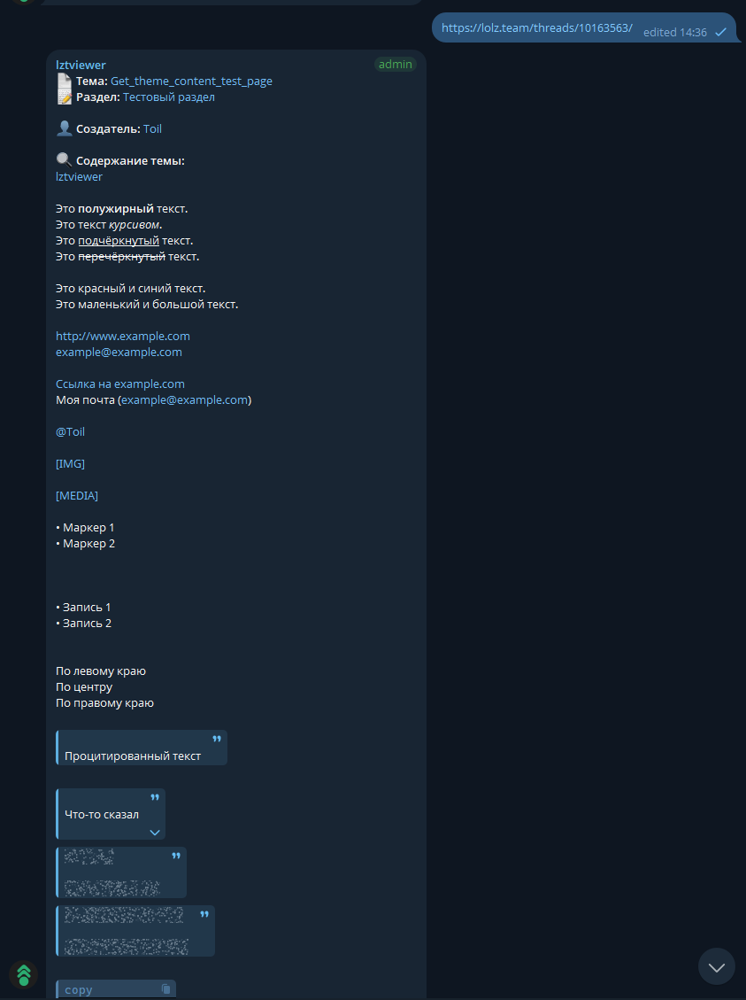
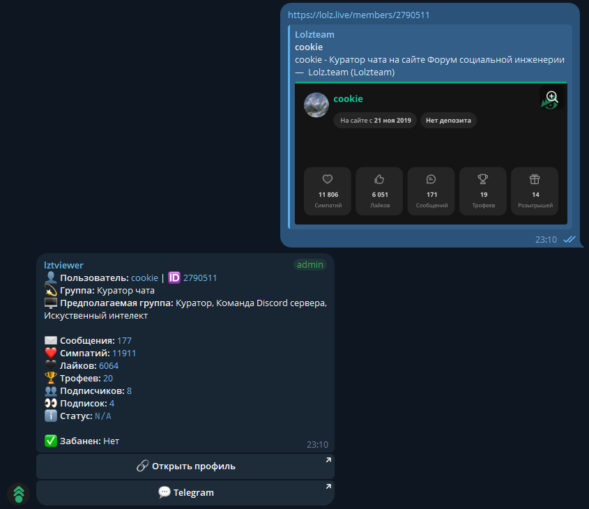

# lzt-viewer-bot

Auto get link content **with formatting preserved** in telegram groups. Powered by [mtcute](https://mtcute.dev/) and [BBob](https://github.com/JiLiZART/BBob)

Supported paths:

- threads/`<xxx>`
- members/`<xxx>`
- posts/`<xxx>`
- posts/comments/`<xxx>`
- profile-posts/`<xxx>`
- /`<xxx>` (custom links to profile)

Supported locales:

- `ru`
- `en`

Shows priority:

```
Thread > Post > Member > Post comment > Profile post > Custom link
```

Note about BBcodes:

- `[API]` --> returns plain text `[API]`
- `[CLUB]` / `[DAYS]` / `[EXCEPTIDS]` / `[LIKES]` / `[LIKES2]` / `[USERIDS]` --> returns `[Hidden content]` or empty string (if `REMOVE_HIDDEN_CONTENT_TAG` is set to `true`)

P.S.: Formatting is preserved as much as Telegram allows

## env

```
API_ID= #tg api id
API_HASH= # tg api hash
BOT_TOKEN= # bot token
GROUP_IDS=123,213,-12321 # allowed groups id (!!!required!!!)
FORUM_DOMAINS=lolz.guru,lolz.live,lolz.team,zelenka.guru # supported forum domains
LZT_API_TOKEN= # your lzt api token
LZT_API_DOMAIN=api.lolz.live # lzt api domain
FORUM_BASE=https://lolz.team # forum base url for perma links
LOCALE=ru # en | ru
REMOVE_HIDDEN_CONTENT_TAG=false # remove hidden content tag from messages (if disabled shows "[Hidden content]")
```

## How to use

0. Install [Bun](https://bun.sh/)
1. Get your `API_HASH` and `API_ID` from [my.telegram.org](https://my.telegram.org/apps)
2. Get your bot token from [@BotFather](https://t.me/BotFather)
3. [Get Lolzteam token](https://lolz.team/account/api) with `basic` and `read` scopes
4. Rename `.env.example` to `.env` and fill in the values
5. Run `bun install --frozen-lockfile` to install dependencies
6. Run `bun start` to start the bot
7. Add your bot to your group and make it admin
8. Add your group id to `GROUP_IDS` in `.env` (id should stars with `-100`)
9. Send a message with a link to the supported paths and the bot will reply with the content of the link
10. Enjoy!

## Run

```bash
bun install --frozen-lockfile
cp .env.example .env
# edit .env
bun start
```

## Previews

### Thread content



### User content


